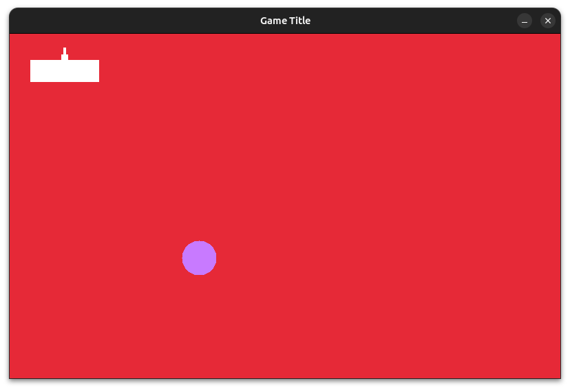

# Tutorial

The following is a tutorial to help us familiarize ourselves with DGL. Please read the [README](../README.md) file first to understand core concepts. If you have any questions, please [contact us](../README.md#contact)!

## Compiling

Compiling a DGL program is done the same way you would compile your Raylib programs. The only difference is that instead of using the `raylib` library file you would use the `DGL` library file. For example, to compile a DGL program on Linux:

```sh
cc source.c -lDGL -lGL -lm -lpthread -ldl -lrt -lX11
```

## Bare Bones program

We will first create a window that will stay open until the user presses the close button on the window's control bar. It is assumed a [DGL session file](../README.md#dgl-session-file) is located at `./DGLsession.dat` relative to the executable.

```c
#include <dgl.h> //mandatory
#include <stdlib.h> //mandatory
#include <stdio.h> //optional

int main()
{
    start("./DGLsession.dat");
    screen_dat.pause_render = false;
    while(running)
        ;
    exit(0);
}
```

#### terminal output:

> Dodge Graphics Library version < DGL version > (Linux) (c) 2024 Jaihson Kresak
>
> a 2D graphics library based on Raylib by Ramon Santamaria.
>
> < game title >
>
> . . .

The `stdio.h` header file is optional. Error messages are typically outputted through the terminal, not the graphical window. Include `stdio.h` if you will report errors and warnings to the user.

The function `start` initiates DGL, starts the renderer, and outputs a small message to terminal.

DGL starts the renderer initially in a paused state. The line

``` c
screen_dat.pause_render = false;
```

unpauses the renderer.

`dgl.h` has the definition `running`, which expands to `!kill_program`. DGL will set `kill_program` to true when the window should close or there is a fatal error.

Typically, C programs terminate with `return 0`. Because DGL uses `atexit` calls to clean up, it is best practice to terminate using `exit(0)`.

### Sprites

In DGL, everything is a [sprite](../README.md#sprites), including the background. To create a sprite, we would declare the structure, then initiate it using the function

```c
int init_sprite(sprite *sp, int width, int height, int x, int y, Color *pixmap)
```

A [pixmap](../README.md#definitions) can be created using the function

```c
Color *pixmap_generate(int shape_type, union shape_info dat, Color colour, Color *out)
```

***see* pixmap_generate [*documentation*](./pixmap.md)**

A pixmap can be loaded from a compatible file using the function

```c
Color *load_pixmap_from_file(char *filename)
```

Sprites are added to layers using the function

```c
int add_sprite(sprite *ns, int layer)
```

## Bare Bones program 2

see [pixmap.md > shinf](./pixmap.md#shinf).

```c
#include <dgl.h>
#include <stdlib.h> 
#include <stdio.h> 

sprite background, circle, character;

int main()
{
    init_sprite(&background, 
        windowWidth, windowHeight, 
        0, 0, 
        pixmap_generate(RECT, 
            shinf(windowWidth, windowHeight), 
            RED,
            NULL)
    );
    add_sprite(&background, 0);

    init_sprite(&circle, 
        50, 50, 
        250, 300, 
        pixmap_generate(CIRCLE, 
            shinf(50, 50), 
            BLUE,
            NULL)
    );
    add_sprite(&circle, 1);

    init_sprite(&character, 
        100, 50, 
        30, 20, 
        load_pixmap_from_file("./sample_pixmap_data.rgba")
    );
    add_sprite(&character, 2);

    start("./DGLsession.dat");
    screen_dat.pause_render = false;
    while(running)
    {
        compile();
    }
    exit(0);
}
```

#### rendered output (example):



As seen in the source, rendering layers and compiling them into the final image is simply done using the `compile()` function. (see [README.md > How does DGL work?](../README.md#how-does-dgl-work)).

## Text

Text is also a sprite. To display text, ***do not*** use Raylib's `DrawText` functions (this will break DGL). To draw text:

1. Initiate an instance of the `text` structure and the `sprite` structure. Set the values of the `text` appropriately.
2. Set the sprite's `image_text` flag to `TEXT` and the `text` value to the address of the text structure.
3. Render.

For example:

```c
#include <dgl.h>
#include <stdlib.h>
int main()
{
    ...

    text msg = 
    {
        .text = "Hello, world!",
        .fontsize = 70,
        .x = 270,
        .y = 200,
        .colour = RED
    };
    sprite msg_sprite = 
    {
        .image_text = TEXT,
        .text = &msg
    };
    add_sprite(&msg_sprite, 1);

    screen_dat.pause_render = false;
    while(running)
    {
        compile();
        
        if(IsKeyDown(KEY_SPACE)) // wait for user to press space
        {
            break;
        }
    }

    ...

    delete_sprite(1);
    exit(0);
}
```

## Entities

Entities are groups of sprites that collectively make a single object on the screen. The move in unison, and a collision to one sprite in an entity will result in a collision flag for the entire entity being set.

This functionality is useful if you wish to create a complex object made of multiple shapes, such as a person. Collision to your person's leg would logically result in collision with the entire entity being set. Also, it would make sense for the person's entire body to move in unison.


## Going forward

The best way to learn to code is by reading code and doing it yourself.

The dgl.h header file has detailed comments the explain what each function does.

Check out the sample programs too to learn more!

Please feel free to [contact us](../README.md#contact) if you'd like more info!
